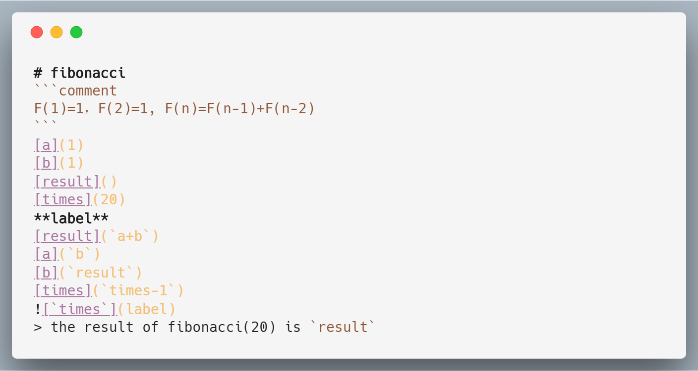

# Using markdown as a programming language


如果将markdown视作一门编程语言可以做哪些有趣的事情？这个项目就是为了解决这个好奇:

# 获取LLMD
## 推荐使用预编译版本：
+ [llmd-win-x86](./bin/llmd-win-x86.exe)

## 源码构建：
三步即可编译得到**llmd**(需要在CMakeLists.txt中配置LLVM libs)：
```bash
$ mkdir build && cd build && cmake .. && make
```

# 示例
> [你好，世界](example/helloworld.md):
```bash
$ llmd helloworld.md
hello, world
```
> 计算[斐波那契数列](example/fibonacci.md)：
```bash
$ llmd fibonacci.md 
the result of fibonacci(20) is 17711
```

# 图灵完备的语法集
```comment               // todo:注释

[var](value)             // 赋值(Literal,Arithmetic)

> hello `var`            // 输出

`a+b`                    // 算术运算(+,-,*) 

**label**                // 跳转标记

       //  条件跳转(condition!=0)

```

# 计划
1. 如果给定的markdown源码无法满足编译要求会报错，而不是直接crash
2. ~~编译最终产物是对象文件或者库文件，可以与C系语言输出进行链接~~

